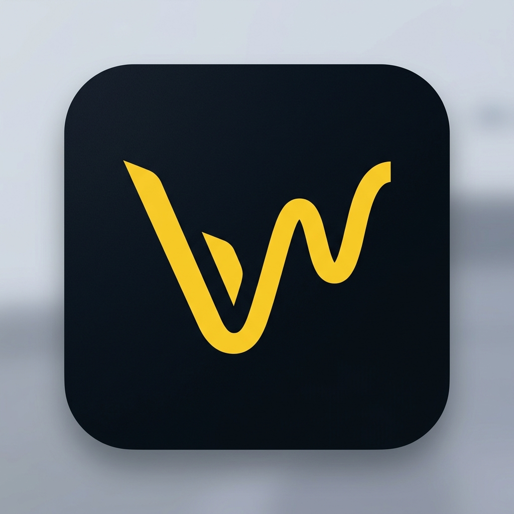

# 🎵 VibraX — The Future of Music Discovery

<p align="center">
  
</p>

<p align="center">
  <strong>Stream, Discover, and Vibe. Your music universe, personalized and persistent.</strong>
</p>

<p align="center">
  <a href="https://vibraxmusic.vercel.app/app"><strong>Live Demo →</strong></a>
</p>

---

## ✨ Features

### 🎧 Core Experience
- **High-Quality Streaming**: Intelligent audio upgrading from iTunes previews to full high-quality streams.
- **Dynamic Search**: Fast and responsive search across millions of tracks, artists, and albums.
- **Synced Lyrics**: Immersive, Spotify-style synced lyrics view with automatic scrolling and background blur.
- **Personalized Library**: Create, edit, and share custom playlists with high-res cover art.

### 📱 Mobile-First PWA
- **Premium Mobile Profile**: A dedicated, high-end profile screen with listening insights and storage management.
- **Unlimited Background Play**: Fully optimized for iOS/Android using the Media Session API and specific web-app tags.
- **Apple Configuration Profile**: Includes a `.mobileconfig` generator for installing VibraX as a native "Web Clip" on iPhone/iPad.
- **Responsive Layout**: Designed to look stunning on everything from the latest iPhones to large-screen iPads.

### 💾 Persistence & Sync
- **Full Data Persistence**: Your player state, favorites, playlists, and even search history are saved locally and restore instantly.
- **Preset System**: Save your entire library state (favorites, playlists, following) to the cloud using Supabase and restore it with a 6-digit code.
- **Multi-Language**: Built-in support for 10+ languages with dynamic Google Translate integration.

### 🎨 Design & UX
- **Premium Aesthetics**: Dark-mode primary design with "Vibrant Gold" accents (`#fcd535`).
- **Dynamic Titles**: Tab titles update dynamically based on the current track or page (e.g., `Song Name | VibraX`).
- **Smooth Animations**: Powered by Framer Motion for a fluid, app-like feel.

---

## 🚀 Tech Stack

- **Framework**: [Next.js 15+](https://nextjs.org/) (App Router)
- **Language**: [TypeScript](https://www.typescriptlang.org/)
- **Styling**: [Tailwind CSS](https://tailwindcss.com/)
- **Animations**: [Framer Motion](https://www.framer.com/motion/)
- **State Management**: [Zustand](https://github.com/pmndrs/zustand) (with Persistence)
- **Database**: [Supabase](https://supabase.com/) (for Presets)
- **Icons**: [Lucide React](https://lucide.dev/)

---

## 🛠️ Installation & Setup

1. **Clone the repository**:
   ```bash
   git clone https://github.com/Erik9910x/VibraX.git
   ```

2. **Install dependencies**:
   ```bash
   npm install
   ```

3. **Configure Environment**:
   Create a `.env.local` with your Supabase credentials (see `.env.example`).

4. **Run development server**:
   ```bash
   npm run dev
   ```

---

## 📱 iOS Installation (Web Clip)

To get the best experience on iOS, generate the installation profile:

1. Update the `APP_URL` in `scripts/generate_mobileconfig.py`.
2. Run the script: `python scripts/generate_mobileconfig.py`.
3. AirDrop the `vibrax.mobileconfig` to your iPhone/iPad and follow the prompts in **Settings > Profile Downloaded**.

---

<p align="center">
  Developed with ❤️ by the VibraX Team.
</p>
